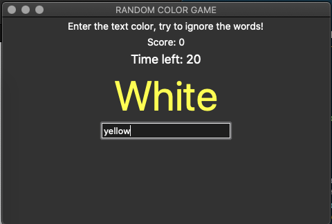

# Random-Color-Game-Python-tkinter

In this game player has to enter color of the word that appears on the screen. If the correct response is entered, the score increases by one. The total time allotted to play the game is 30 seconds. The colors available are Red, Blue, Green, Pink, Black, Yellow, Orange, White, Purple and Brown. The Interface will display the name of a color in a randomized color. The Player is tasked to identify the color and enter the correct color name to "win" the game.

